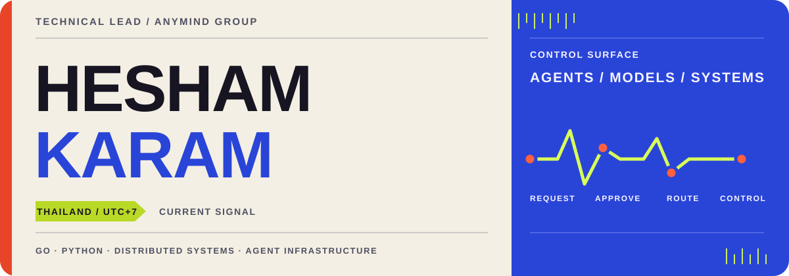
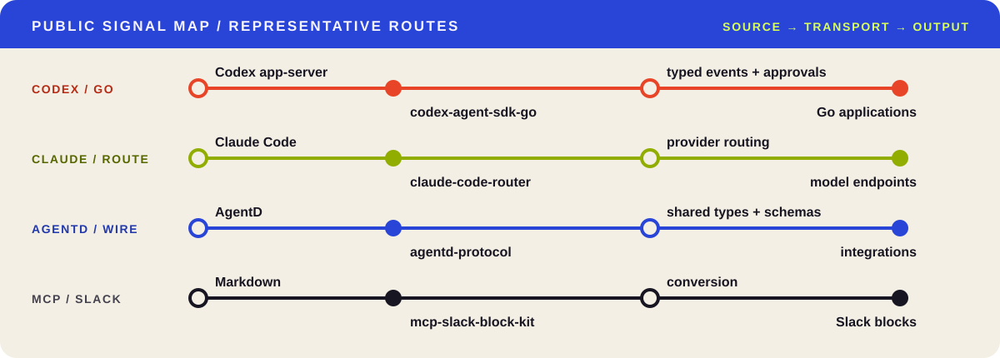

<!--
  SIGNAL BENCH / SOURCE NOTE
  If you are reading this, you found the fifth route.
  request → approve → route → control
  The visuals below are repository-local: no external stats or card service required.
-->

<picture>
  <source media="(max-width: 600px) and (prefers-color-scheme: dark)" srcset="./assets/signal-bench-mobile-dark.svg">
  <source media="(max-width: 600px) and (prefers-color-scheme: light)" srcset="./assets/signal-bench-mobile-light.svg">
  <source media="(prefers-color-scheme: dark)" srcset="./assets/signal-bench-dark.svg">
  <source media="(prefers-color-scheme: light)" srcset="./assets/signal-bench-light.svg">
  
</picture>

  <a href="https://github.com/hishamkaram?tab=repositories"><strong>PUBLIC SYSTEMS</strong></a>
  &nbsp;/&nbsp;
  <a href="https://www.linkedin.com/in/hesham-karm/"><strong>LINKEDIN</strong></a>
  &nbsp;/&nbsp;
  <a href="https://medium.com/@hishamkaram"><strong>WRITING</strong></a>

I build the infrastructure between coding agents and the systems that run them: typed transports, model routing, approval-aware control, and shared protocols. At **AnyMind Group**, I work as a **Technical Lead** on publisher-growth software in Thailand.

<picture>
  <source media="(prefers-color-scheme: dark)" srcset="./assets/signal-pulse-dark.gif">
  <source media="(prefers-color-scheme: light)" srcset="./assets/signal-pulse-light.gif">
  
</picture>

## Public signal map

<picture>
  <source media="(max-width: 600px) and (prefers-color-scheme: dark)" srcset="./assets/system-map-mobile-dark.svg">
  <source media="(max-width: 600px) and (prefers-color-scheme: light)" srcset="./assets/system-map-mobile-light.svg">
  <source media="(prefers-color-scheme: dark)" srcset="./assets/system-map-dark.svg">
  <source media="(prefers-color-scheme: light)" srcset="./assets/system-map-light.svg">
  
</picture>

## Open routes

| Route | What it carries |
|:--|:--|
| **Codex ⇄ Go** [codex-agent-sdk-go](https://github.com/hishamkaram/codex-agent-sdk-go) | Typed access to the Codex app-server transport, streaming events, approvals, MCP configuration, and structured output. |
| **Claude ⇄ providers** [claude-code-router](https://github.com/hishamkaram/claude-code-router) | A loopback gateway for using Claude Code with Anthropic and OpenAI-compatible providers in the same session. |
| **Claude ⇄ Go** [claude-agent-sdk-go](https://github.com/hishamkaram/claude-agent-sdk-go) | A typed Go API for the Claude Code subprocess protocol, sessions, hooks, and streaming. |
| **AgentD ⇄ integrations** [agentd-protocol](https://github.com/hishamkaram/agentd-protocol) | Shared wire types and schemas for AgentD integrations. |
| **Markdown ⇄ Slack** [mcp-slack-block-kit](https://github.com/hishamkaram/mcp-slack-block-kit) | A credential-free Go MCP server and CLI for Markdown and Slack Block Kit conversion. |

  
<strong>Maintenance channel — mature GeoServer packages</strong>

   

  These are long-running open-source projects I continue to maintain. They show historical depth, but geospatial engineering is not my current professional focus.

  - **[geoserver](https://github.com/hishamkaram/geoserver)** — Go client for the GeoServer REST API.
  - **[gismanager](https://github.com/hishamkaram/gismanager)** — command-line and Go-library workflows for publishing GIS data to GeoServer through PostGIS.

  
<strong>Operator record</strong>

   

  - **Technical Lead, AnyMind Group** — January 2023 to present · Thailand
  - **Senior Software Engineer, AnyMind Group** — December 2019 to January 2023 · Bangkok
  - **12+ years** building software professionally across product platforms, distributed systems, developer tooling, and open source

  
<strong>Working instruments</strong>

   

  `Go` · `Python` · `TypeScript` · `PostgreSQL` · `Redis` · `Docker` · `Kubernetes` · `GCP` · `AWS` · `GitHub Actions` · `MCP` · `JSON-RPC`

---

THAILAND / UTC+7 · BUILDING DEPENDABLE SYSTEMS AND OPEN SOURCE THAT STAYS MAINTAINED

